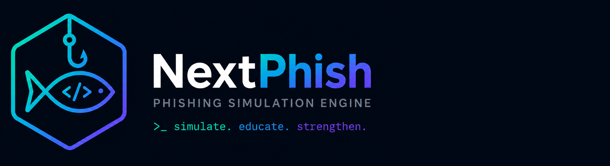

# NextPhish

NextPhish is an open-source phishing simulation engine built with Next.js. It lets companies run internal phishing campaigns against their own employees to assess security awareness, replacing legacy tools like GoPhish.

## Why NextPhish?

GoPhish is no longer maintained and suffers from persistent issues — buggy template management, no proper API, difficult multi-user workflows. NextPhish is built from the ground up with a modern stack:

- **Type-safe end to end** — tRPC ensures your API contracts are never out of sync
- **Developer-friendly** — full TypeScript, DDD modules, dependency injection
- **Queue-driven campaigns** — BullMQ handles scheduling, delivery, and event tracking at scale
- **Multi-tenant ready** — BetterAuth + Prisma make per-organisation isolation straightforward
- **Lightweight landing pages** — Hono serves phishing page HTML directly from the database on a separate port, keeping the main app secure

Check `docs/architecture.md` for the full stack and structure.

## Getting Started

See [docs/setup.md](docs/setup.md) for local environment setup.

## MCP Server

NextPhish includes an MCP (Model Context Protocol) server that lets AI assistants like Claude and Cursor interact with your instance through natural language. See [docs/mcp-setup.md](docs/mcp-setup.md) for setup instructions and the full tool reference.

## License

MIT
